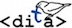

# Sample DITA project

DITA topic collection for a fictional product. This repository was created for Virginia Tech's ENGL 3814: Creating User Documentation, but any DITA aficionados can use it following the license at the bottom of this page. 

## Credits:
- Written by Kevin Lewis
- Edits and annoying comments by Carlos Evia (cevia@vt.edu)

**DITA is good for you** 

 This work is licensed under a <a rel="license" href="http://creativecommons.org/licenses/by-nc-sa/4.0/">Creative Commons Attribution-NonCommercial-ShareAlike 4.0 International License</a>.
